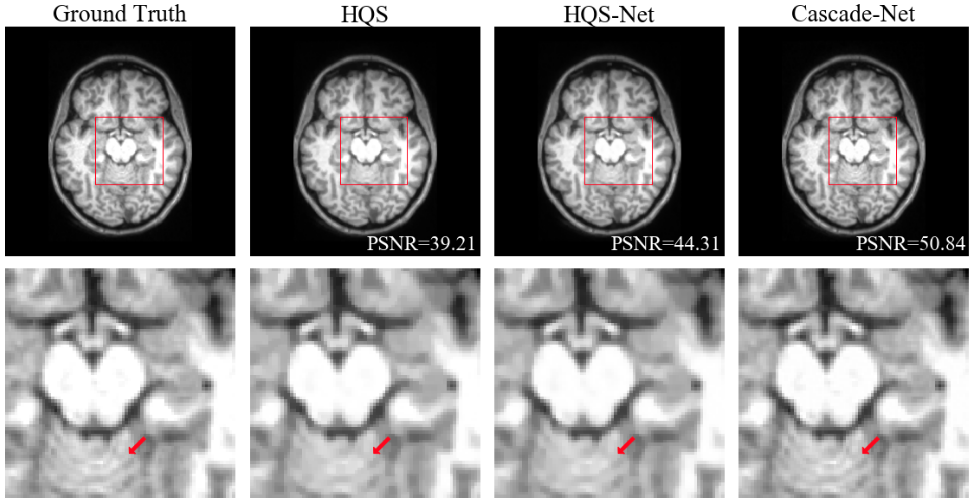

# HQS-Net: Neural Network-based Reconstruction in Compressed Sensing MRI Without Fully-sampled Training Data

[link to paper](https://arxiv.org/abs/2007.14979)

## Abstract
Compressed Sensing MRI (CS-MRI) has shown promise in reconstructing under-sampled MR images, offering the potential to reduce scan times. Classical techniques minimize a regularized least-squares cost function using an expensive iterative optimization procedure. Recently, deep learning models have been developed that model the iterative nature of classical techniques by unrolling iterations in a neural network. While exhibiting superior performance, these methods require large quantities of ground-truth images and have shown to be non-robust to unseen data. In this paper, we explore a novel strategy to train an unrolled reconstruction network in an unsupervised fashion by adopting a loss function widely-used in classical optimization schemes. We demonstrate that this strategy achieves lower loss and is computationally cheap compared to classical optimization solvers while also exhibiting superior robustness compared to supervised models.

## Requirements
This code was tested on:
- python 3.7.5
- pytorch 1.3.1
- matplotlib 3.1.2
- numpy 1.17.4
- tqdm 4.41.1

## Usage
Training with example data:

    python scripts/run.py --lmbda 1.8 --w_coeff 0.002 --tv_coeff 0.005

## Contact
Feel free to open an issue for any problems or questions.
